# SmartPlate: Delivery-Style Restaurant Management System

**Course:** Introduction to Database Systems (CSD317)

**Project:** SmartPlate

**GitHub Repo**: [https://github.com/DJ-22/SmartPlate](https://github.com/DJ-22/SmartPlate)

**Group No:** 7

**Group Members:** Arnav Jyoti (2410110071), Breeti Bandyopadhyay (2410110105), Daksh Jain (2410110113), Devv Khemani (2410110119), Medhavee Binnani (2410110198)

---

## 1. Objective

SmartPlate is a role-based restaurant management system for a delivery-only kitchen. A single **MySQL** database backs five distinct web dashboards (customer, chef, employee, supplier, manager) served by a **FastAPI** layer. The goal is to demonstrate a realistic, transactional DBMS design covering the full operational loop of a restaurant from ingredient receipt, through cooking and delivery, to sales history; while adding a SQL-only forecasting layer that drives minimum-stock and dynamic-pricing decisions.

Beyond CRUD, the database itself enforces domain rules: stock is deducted by triggers the moment an order item is placed, auto-reorders fire when an ingredient falls below its threshold, batch statuses advance on a daily event schedule, and sales history is written only on delivery. The application layer is intentionally thin; most invariants live in the database.

## 2. Features

### 2.1 Role-scoped dashboards

| Role     | Core features                                                                                                                                            |
| -------- | -------------------------------------------------------------------------------------------------------------------------------------------------------- |
| Customer | Browse menu, start an order, add/cancel items while still being prepared, view past orders, see delivery alerts.                                         |
| Chef     | View active orders, mark items "Out for delivery" and "Delivered", view history of all orders.                                                           |
| Employee | View ingredients and their suppliers, place replenishment batches.                                                                                       |
| Supplier | Manage `Supplies`(price/unit per ingredient), update pending batch statuses, edit own profile.                                                         |
| Manager  | Full CRUD over ingredients, menu items, recipes, suppliers, users, batches, compliance, weather, occasions, gift codes, and nutrition. Runs forecasting. |

### 2.2 Automated flows (enforced in SQL)

* **FIFO stock deduction on order** : inserting into `Menu_Orders_Items` deducts ingredient quantities and drains oldest-expiring delivered batches first.
* **Availability guard** : orders are rejected (`SIGNAL 45000`) if recipe requirements exceed current stock.
* **Auto-reorder** : an ingredient crossing below `min_stock` with no pending batch automatically creates an order from the fastest active supplier.
* **Daily batch progression** : `evt_update_batch_status` promotes ordered → shipped (30% of delivery time) → delivered (100%); `evt_expire_batches` removes expired inventory and writes waste records.
* **Sales history on delivery** : `Sales_History` is only written when an item's status flips to `delivered`, tagged with the day's `Occasion`.
* **Forecasting** : heuristic SQL procedures analyse 90 days of same-weekday sales, adjust for occasions and weather, and populate `Ingredient_Reorder_Forecast` and `Item_Price_Override`. Managers review and explicitly apply.

### 2.3 Authentication and authorisation

* JWT-based login (24 h lifetime).
* Passwords hashed with bcrypt via `passlib`.
* `require_role()` decorator guards every endpoint; managers pass any role check.
* `sp_RegisterUser` validates the role against a whitelist `(manager, chef, employee, supplier, customer)`.

## 3. ER Model

### 3.1 Entities and attributes (condensed)

* **User** ( *user_id* , username, email, password_hash, last_login, role_id)
* **Role** ( *role_id* , name, description)
* **Permission** ( *permission_id* , name, description)
* **Customer** ( *customer_id* , name, visit_frequency, user_id)
* **Employee** ( *employee_id* , hire_date, salary, user_id)
* **Supplier** ( *supplier_id* , name, contact, delivery_time, is_active, user_id)
* **Allergen** ( *allergen_id* , name, description)
* **Ingredient** ( *ingredient_id* , name, unit, quantity, min_stock, allergen_id)
* **InventoryBatch** ( *inventory_batch_id* , purchase_date, expiry_date, quantity, unit, cost, status, supplier_id, ingredient_id)
* **WasteRecord** ( *waste_record_id* , quantity, timestamp, inventory_batch_id)
* **Log** ( *log_id* , timestamp, quantity, status, ingredient_id)
* **Category** ( *category_id* , name)
* **Item** ( *item_id* , name, description, price, prep_time, is_active, category_id)
* **NutritionalInfo** ( *item_id* , calories, protein, carbs, fat, fiber)
* **GiftCode** ( *gift_code_id* , code, amount, type, min_order, valid_from, valid_to)
* **MenuOrder** ( *menu_order_id* , order_time, price, gift_code_id, user_id)
* **Alert** ( *alert_id* , message)
* **Occasion** ( *occasion_id* , name, description, date)
* **SalesHistory** ( *sales_history_id* , quantity, item_id, menu_order_id, occasion_id)
* **SustainabilityRecord** ( *sustainability_record_id* , date, carbon_footprint, item_id, menu_order_id)
* **ComplianceRecord** ( *compliance_record_id* , inspection_date, status, description)
* **WeatherData** ( *date* , temperature, humidity)
* **IngredientReorderForecast** ( *forecast_id* , ingredient_id, forecast_date, predicted_min_stock, applied, generated_at)
* **ItemPriceOverride** ( *override_id* , item_id, effective_date, price, reason, applied, generated_at)

### 3.2 Relationships

| Relationship                            | Cardinality | Modelling                                                       |
| --------------------------------------- | ----------- | --------------------------------------------------------------- |
| User — Role                            | N : 1       | `Users.role_id`FK                                             |
| User — Customer / Employee / Supplier  | 1 : 0..1    | Specialisation tables with `user_id`FK                        |
| Role — Permission                      | M : N       | `Permissions_Granted`junction                                 |
| Supplier — Ingredient (catalogue)      | M : N       | `Supplies(supplier_id, ingredient_id)`with `price_per_unit` |
| Supplier — InventoryBatch              | 1 : N       | `Inventory_Batches.supplier_id`FK                             |
| Ingredient — InventoryBatch            | 1 : N       | `Inventory_Batches.ingredient_id`FK                           |
| InventoryBatch — WasteRecord           | 1 : N       | `Waste_Records.inventory_batch_id`FK                          |
| Ingredient — Log                       | 1 : N       | `Logs.ingredient_id`FK                                        |
| Item — Ingredient (recipe)             | M : N       | `Recipes(item_id, ingredient_id)`with `quantity`,`unit`   |
| Item — NutritionalInfo                 | 1 : 1       | Shared PK `item_id`                                           |
| Item — Category                        | N : 1       | `Items.category_id`FK                                         |
| User — MenuOrder                       | 1 : N       | `Menu_Orders.user_id`FK                                       |
| MenuOrder — Item                       | M : N       | `Menu_Orders_Items`with `quantity`,`status`, SLA times    |
| MenuOrder — GiftCode                   | N : 0..1    | `Menu_Orders.gift_code_id`FK                                  |
| MenuOrder — SalesHistory               | 1 : N       | Written only on delivery                                        |
| MenuOrder — Occasion                   | N : 1       | Via `Sales_History.occasion_id`                               |
| Alert — User                           | M : N       | `Alerted(alert_id, user_id, created_at, read_at)`             |
| Ingredient — IngredientReorderForecast | 1 : N       | Unique per `(ingredient_id, forecast_date)`                   |
| Item — ItemPriceOverride               | 1 : N       | Unique per `(item_id, effective_date)`                        |

A User entity generalises Customer, Employee, and Supplier via disjoint specialisation: each specialisation table holds the User FK and the role-specific attributes.

## 4. Relational Model

The full DDL lives in `Database Creation/init_schema.sql`. Primary keys are surrogate `AUTO_INCREMENT` integers except:

* **Composite PKs** : `Supplies(supplier_id, ingredient_id)`, `Recipes(item_id, ingredient_id)`, `Menu_Orders_Items(menu_order_id, item_id)`, `Permissions_Granted(permission_id, role_id)`, `Alerted(alert_id, user_id)`.
* **Natural PK** : `Weather_Data(date)` — daily grain.
* **Shared PK with parent** : `Nutritional_Info(item_id)`.

### 4.1 Status / flag encodings

Status codes are compact `TINYINT` with `CHECK IN (…)` constraints:

| Table                   | Column        | Values                                                  |
| ----------------------- | ------------- | ------------------------------------------------------- |
| `Inventory_Batches`   | `status`    | 0 = ordered, 1 = shipped, 2 = delivered                 |
| `Logs`                | `status`    | 0 = in_storage, 1 = used, 2 = expired                   |
| `Menu_Orders_Items`   | `status`    | 0 = being prepared, 1 = out for delivery, 2 = delivered |
| `Compliance_Records`  | `status`    | 0 = waiting, 1 = passed, 2 = failed                     |
| `Gift_Code`           | `type`      | 0 = flat, 1 = percentage                                |
| `Items`,`Suppliers` | `is_active` | 0 / 1                                                   |

### 4.2 Referential-action choices

* `ON DELETE CASCADE` for junction / dependent rows (`Recipes`, `Menu_Orders_Items`, `Alerted`, `Permissions_Granted`, `Supplies`, `Customers`, `Nutritional_Info`, `Waste_Records`, forecast / override tables).
* `ON DELETE RESTRICT` for referentially important masters (`Roles`, `Allergens`, `Category`, `Users` via `Employees`, `Ingredients`, `Items` in `Menu_Orders`).
* `ON DELETE SET NULL` only where the relationship is optional (`Suppliers.user_id`, `Sustainability_Records.item_id`).
* All FKs are `ON UPDATE CASCADE`.

## 5. Normalization

The schema is in **3NF / BCNF** for all analytical tables.

### 5.1 Worked example — Items + Nutritional_Info

Rather than putting nutrition columns on `Items`, they are factored out:

* `Items(item_id → name, description, price, prep_time, is_active, category_id)` — every non-key attribute depends on the PK.
* `Nutritional_Info(item_id → calories, protein, carbs, fat, fiber)` — 1:1 with `Items`, nullable for "unknown", avoiding a sparse row in `Items`.

### 5.2 Many-to-many decompositions

* `Supplies(supplier_id, ingredient_id → price_per_unit, unit)` decomposes the Supplier/Ingredient catalogue to eliminate repeating groups.
* `Recipes(item_id, ingredient_id → quantity, unit)` does the same for the Item/Ingredient relationship.
* `Menu_Orders_Items(menu_order_id, item_id → quantity, status, prepared_at, dispatched_at, delivered_at)` is the line-item relation for orders.
* `Permissions_Granted(permission_id, role_id)` and `Alerted(alert_id, user_id → created_at, read_at)` similarly isolate M:N links.

### 5.3 Transitive-dependency removals

* Allergens live in `Allergens`, not repeated on `Ingredients`.
* Categories live in `Category`, not repeated on `Items`.
* Role/Permission separation keeps permission changes independent of role assignment.

### 5.4 Intentional denormalisations

* `Menu_Orders.price` is a cached total (trigger- and proc-maintained). Recomputable from line items; kept for read-path speed.
* `Customers.visit_frequency` is a denormalised counter updated on order events.
* `Menu_Orders_Items.{prepared_at, dispatched_at, delivered_at}` caches status transition times for ML features (SLA per-item, per-stage).

## 6. SQL Commands Used

The project exercises a wide slice of SQL.

### 6.1 DDL

`CREATE DATABASE`, `CREATE TABLE` with `AUTO_INCREMENT`, `CHECK`, `UNIQUE KEY`, composite `PRIMARY KEY`, `FOREIGN KEY … ON DELETE … ON UPDATE …`, explicit secondary `KEY` indexes; `CREATE VIEW`, `CREATE PROCEDURE`, `CREATE TRIGGER`, `CREATE EVENT`; `DROP … IF EXISTS`; `SET FOREIGN_KEY_CHECKS`; `SET GLOBAL event_scheduler = ON`.

### 6.2 DML

`INSERT … VALUES`, `INSERT IGNORE`, `INSERT … ON DUPLICATE KEY UPDATE`, `INSERT … SELECT`, multi-table `UPDATE` with `JOIN`, `DELETE` with `WHERE`, `SELECT … INTO` for variables, `SELECT` using `JOIN`, `LEFT JOIN`, `GROUP BY`, `ORDER BY … LIMIT`, `COALESCE`, `GREATEST`, `CASE WHEN`, window-like aggregates via `GROUP BY`, `DATE_SUB(… INTERVAL 90 DAY)`, `TIMESTAMPDIFF`, `DAYOFWEEK`, `DATE()`, `NOW()`, `LAST_INSERT_ID()`.

### 6.3 Transaction control

`START TRANSACTION`, `COMMIT`, `ROLLBACK`, `DECLARE EXIT HANDLER FOR SQLEXCEPTION`, `SIGNAL SQLSTATE '45000'`, `RESIGNAL`.

### 6.4 Representative queries

* Active orders for chef:
  ```sql
  SELECT mo.menu_order_id, oi.item_id, i.name, oi.quantity, oi.status
  FROM Menu_Orders mo
  JOIN Menu_Orders_Items oi ON oi.menu_order_id = mo.menu_order_id
  JOIN Items i ON i.item_id = oi.item_id
  WHERE oi.status IN (0, 1)
  ORDER BY mo.order_time;
  ```
* Ingredient shortfall (availability guard inside `trg_after_order_item`):
  ```sql
  SELECT COUNT(*)
  FROM Recipes r
  JOIN Ingredients i ON i.ingredient_id = r.ingredient_id
  WHERE r.item_id = NEW.item_id
    AND i.quantity < r.quantity * NEW.quantity;
  ```
* 90-day same-weekday demand view (`v_daily_item_sales`):
  ```sql
  SELECT DATE(mo.order_time) AS sale_date, oi.item_id, SUM(oi.quantity) AS qty
  FROM Menu_Orders_Items oi
  JOIN Menu_Orders mo ON oi.menu_order_id = mo.menu_order_id
  GROUP BY DATE(mo.order_time), oi.item_id;
  ```

## 7. Stored Procedures

All procedures live in `Database Creation/procedures.sql` and `Database Creation/ml_forecast.sql`.

| Procedure                 | Purpose                                                                                                                                                           |
| ------------------------- | ----------------------------------------------------------------------------------------------------------------------------------------------------------------- |
| `sp_RegisterUser`       | Validates role whitelist, inserts `Users`row, and creates the correct specialisation row (Customer / Employee / Supplier). Transactional with rollback handler. |
| `sp_AddIngredient`      | Idempotent allergen upsert + ingredient insert. Auto-reorder trigger fires if `min_stock > 0`.                                                                  |
| `sp_AddMenuItem`        | Idempotent category upsert + menu item insert.                                                                                                                    |
| `sp_AddRecipeLine`      | Upsert into `Recipes`keyed on `(item_id, ingredient_id)`.                                                                                                     |
| `sp_ReceiveBatch`       | Looks up supplier price/unit, inserts a `status=0`batch with computed cost.                                                                                     |
| `sp_LogWaste`           | Validates batch existence and quantity bounds, writes `Waste_Records`,`Logs`, and decrements stock.                                                           |
| `sp_PlaceOrder`         | Creates an empty `Menu_Orders`row and returns its id.                                                                                                           |
| `sp_AddOrderItem`       | Validates quantity/active item, inserts line item (triggering FIFO deduction), updates cached order price.                                                        |
| `sp_CancelOrderItem`    | Cursor-based re-credit of recipe quantities into `Ingredients`, deletes the line item, recomputes order price. Only allowed while status = 0.                   |
| `sp_LogCompliance`      | Inserts a `Compliance_Records`row with the current timestamp.                                                                                                   |
| `sp_RecordWeather`      | Daily `INSERT … ON DUPLICATE KEY UPDATE`for `Weather_Data`.                                                                                                  |
| `sp_ForecastItemDemand` | OUT-parameter heuristic: 90-day same-weekday average with occasion and weather multipliers.                                                                       |
| `sp_RecomputeMinStocks` | Populates `Ingredient_Reorder_Forecast`from recipe-weighted item demand.                                                                                        |
| `sp_RecomputePricing`   | Populates `Item_Price_Override`from 90-day demand ratios (`high_demand_forecast`,`low_demand_discount`).                                                    |
| `sp_ApplyForecasts`     | Transactional apply of pending min-stock forecasts into `Ingredients.min_stock`.                                                                                |
| `sp_ApplyPricing`       | Transactional apply of pending price overrides into `Items.price`(skips `no_change`).                                                                         |

## 8. Triggers

All defined in `Database Creation/triggers.sql`.

| Trigger                         | Event                              | Behaviour                                                                                                                                                                                                                                                                   |
| ------------------------------- | ---------------------------------- | --------------------------------------------------------------------------------------------------------------------------------------------------------------------------------------------------------------------------------------------------------------------------- |
| `trg_after_order_item`        | AFTER INSERT `Menu_Orders_Items` | (1) Availability guard via shortfall count — SIGNALs if stock is insufficient. (2) Cursor over recipe, decrement `Ingredients.quantity`, FIFO-drain `Inventory_Batches`(status=2) by `expiry_date`, write `Logs`. (3) Create alert +`Alerted`row for every chef. |
| `trg_after_batch_delivered`   | AFTER UPDATE `Inventory_Batches` | On status 0/1 → 2, add batch quantity to `Ingredients`, write a `status=0`(in_storage) log.                                                                                                                                                                            |
| `trg_after_ingredient_update` | AFTER UPDATE `Ingredients`       | When `quantity`just crossed `min_stock`and no pending batch exists, auto-create an order from the fastest active supplier with `quantity = GREATEST(min_stock * 2, 1)`.                                                                                               |
| `trg_after_ingredient_insert` | AFTER INSERT `Ingredients`       | Same auto-reorder behaviour, fired once on creation if `min_stock > 0`.                                                                                                                                                                                                   |
| `trg_after_order_item_status` | AFTER UPDATE `Menu_Orders_Items` | Rejects backwards transitions. On 0→1 writes `dispatched_at`and alerts the customer. On 1→2 writes `delivered_at`, looks up or inserts a "Regular"`Occasion`, and writes `Sales_History`.                                                                         |

## 9. Functions

No user-defined SQL functions (`CREATE FUNCTION`) are required, every computed metric that could have been wrapped in one (order total, predicted demand, batch cost, available stock) is already produced by a stored procedure or a view. MySQL built-ins used extensively: `NOW()`, `DATE()`, `DATE_SUB()`, `DAYOFWEEK()`, `TIMESTAMPDIFF()`, `COALESCE()`, `GREATEST()`, `ROUND()`, `AVG()`, `SUM()`, `COUNT()`.

## 10. Cursors

Two cursors are declared in stored procedures and one implicit cursor pattern inside a trigger:

1. **`sp_CancelOrderItem`** — cursor over `Recipes` rows for the cancelled item, adding `recipe.quantity * line.quantity` back to `Ingredients`:
   ```sql
   DECLARE ing_cur CURSOR FOR
       SELECT ingredient_id, quantity FROM Recipes WHERE item_id = p_item_id;
   DECLARE CONTINUE HANDLER FOR NOT FOUND SET done = 1;
   OPEN ing_cur;
   ing_loop: LOOP
       FETCH ing_cur INTO ing_id, recipe_qty;
       IF done THEN LEAVE ing_loop; END IF;
       UPDATE Ingredients SET quantity = quantity + (recipe_qty * v_qty)
       WHERE ingredient_id = ing_id;
   END LOOP ing_loop;
   CLOSE ing_cur;
   ```
2. **`trg_after_order_item`** — recipe cursor for ingredient deduction plus a nested chef cursor for alert fan-out:
   ```sql
   DECLARE ing_cur CURSOR FOR
       SELECT ingredient_id, quantity FROM Recipes WHERE item_id = NEW.item_id;
   DECLARE chef_cur CURSOR FOR
       SELECT u.user_id FROM Users u
       JOIN Roles r     ON u.role_id = r.role_id
       JOIN Employees e ON e.user_id = u.user_id
       WHERE LOWER(r.name) IN ('chef','kitchen');
   ```

## 11. Transactions

Every multi-statement write-path procedure declares an `EXIT HANDLER FOR SQLEXCEPTION` that rolls back and `RESIGNAL`s before issuing `START TRANSACTION`:

```sql
DECLARE EXIT HANDLER FOR SQLEXCEPTION
BEGIN ROLLBACK; RESIGNAL; END;

START TRANSACTION;
... (multi-statement work) ...
COMMIT;
```

This pattern is used in `sp_RegisterUser`, `sp_AddIngredient`, `sp_AddMenuItem`, `sp_LogWaste`, `sp_AddOrderItem`, `sp_CancelOrderItem`, `sp_ApplyForecasts`, and `sp_ApplyPricing`. Single-statement procedures (`sp_ReceiveBatch`, `sp_PlaceOrder`, `sp_AddRecipeLine`, `sp_LogCompliance`, `sp_RecordWeather`) rely on InnoDB's per-statement atomicity. On the backend side, PyMySQL connections use `autocommit=True` for simple reads; write endpoints that call multi-statement procedures rely on the procedure-level transaction for atomicity. InnoDB (default storage engine) is required.

Read consistency for cursors inside triggers / procedures is provided by the REPEATABLE READ isolation level (MySQL default). SIGNAL-based failures — stock shortfall, invalid role, negative quantity, backwards status transition — bubble up as SQLSTATE `45000` (errno `1644`), which the FastAPI layer translates to an HTTP 400 with the user-facing message.

## 12. Events

| Event                       | Schedule     | Behaviour                                                                                                   |
| --------------------------- | ------------ | ----------------------------------------------------------------------------------------------------------- |
| `evt_update_batch_status` | daily        | Promotes batches ordered → shipped after 30% of supplier `delivery_time`, shipped → delivered at 100%.  |
| `evt_expire_batches`      | daily +1 min | Writes `Waste_Records`and `Logs`for expired batches, decrements `Ingredients.quantity`, deletes rows. |

Both require `SET GLOBAL event_scheduler = ON` (SUPER privilege). A manual alternative is `CALL` on replacement procs, but the event-driven design keeps the application layer stateless.

## 13. Views (Forecasting Layer)

Defined in `ml_forecast.sql`:

* `v_daily_item_sales` — per-day, per-item ordered quantity and distinct-order counts.
* `v_daily_ingredient_usage` — rolls up sales through `Recipes` into ingredient usage per day.
* `v_daily_features` — left-joins `Weather_Data` and `Occasions` onto each sales date, producing the feature row consumed by the forecasting procedures.

## 14. Architecture

```
Browser (static HTML/JS dashboards, sessionStorage JWT)
    │  fetch() → http://localhost:8000/api/v1/*
    ▼
FastAPI (Python)         ── auth.py (bcrypt + python-jose)
    │                    ── database.py (PyMySQL, dotenv)
    │   CALL sp_*        ── main.py (role-scoped routes)
    ▼
MySQL 8.x
    • init_schema.sql   • procedures.sql   • triggers.sql
    • events.sql        • ml_schema.sql    • ml_forecast.sql
    • dummy_data.sql
```

The backend exposes ~80 REST endpoints grouped by role prefix (`/user/*`, `/chef/*`, `/employee/*`, `/supplier/*`, `/manager/*`) plus `/login`, `/register`, `/health`. Every write delegates to a stored procedure so that business rules live with the data.

## 15. Novelty

The novel piece of SmartPlate is its  **fully database-driven automatic reordering loop** . The application layer never decides when to restock; the entire cycle; detection, supplier selection, batch progression, stock replenishment is encoded in triggers and events on the data itself. Once an ingredient is configured with a `min_stock` and at least one `Supplies` row, the database keeps it stocked without any human or service touching it.

### 15.1 The cycle

1. **Detection (`trg_after_ingredient_update` / `trg_after_ingredient_insert`)**

   Any path that reduces `Ingredients.quantity` — order-time deduction (`trg_after_order_item`), waste logging (`sp_LogWaste`), expiry sweep (`evt_expire_batches`), or a manager edit — fires `trg_after_ingredient_update`. When `quantity` *just crosses* below `min_stock` (`OLD.quantity > NEW.min_stock AND NEW.quantity <= NEW.min_stock`) and no in-flight batch already exists (`status IN (0,1)`), a reorder is needed. The "just crossed" guard is what prevents the trigger from firing redundantly on every subsequent decrement while a batch is already on its way. A symmetric trigger on insert handles the bootstrap case for newly created ingredients.
2. **Supplier selection**

   The trigger picks the fastest active supplier that actually carries the ingredient by joining `Suppliers` with `Supplies` and ordering by `delivery_time ASC LIMIT 1`. Suppliers without a `Supplies` row for that ingredient are skipped automatically — no application logic required.
3. **Batch creation**

   A new `Inventory_Batches` row is inserted with `status = 0` (ordered) and `quantity = GREATEST(min_stock * 2, 1)`. Doubling `min_stock` ensures the delivery actually restocks the ingredient comfortably above threshold; the `GREATEST(..., 1)` guard handles the degenerate `min_stock = 0` case.
4. **Daily progression (`evt_update_batch_status`)**

   A scheduled event runs once per day and walks batches through their lifecycle based on the supplier's stated `delivery_time`: `ordered → shipped` after 30% of `delivery_time` has elapsed since `purchase_date`, then `shipped → delivered` at 100%. This simulates real-world fulfilment without needing webhook/event-driven supplier integrations.
5. **Replenishment (`trg_after_batch_delivered`)**

   When a batch flips to `status = 2` (delivered), this trigger atomically adds the batch quantity to `Ingredients.quantity` and writes a `Logs` row with `status = 0` (in storage). The same trigger handles supplier-marked deliveries and event-driven ones, so manual and automatic flows share one code path.

### 15.2 What this design buys

* **Crash-safe by construction.** The whole cycle is built out of MySQL triggers and a daily event, both running inside InnoDB transactions. A backend restart, a stuck Python worker, or a missing cron entry cannot break stock continuity.
* **Self-healing on schema events.** Even bulk operations the application doesn't know about — bulk waste imports, manual `UPDATE`s in a SQL client, expired-batch sweeps — flow through the same triggers and produce the same auto-reorder behavior.
* **Trivially auditable.** Every state transition leaves a `Logs` row (`status` 0 / 1 / 2 distinguishing replenishment, consumption, expiry) and every reorder leaves an `Inventory_Batches` row whose lifecycle (ordered → shipped → delivered, with `purchase_date` and `expiry_date`) reconstructs the full reorder history without any extra audit table.
* **Pluggable forecasting.** `min_stock` itself is a write-back target of the forecasting layer: `sp_RecomputeMinStocks` predicts per-ingredient demand and `sp_ApplyForecasts` updates `Ingredients.min_stock`. That update fires `trg_after_ingredient_update`, which can then auto-reorder against the new threshold — closing the loop between prediction and physical replenishment without any glue code.

## 16. Limitations

1. **Supplier confirmation of auto-orders** : auto-reorders land as `status=0` batches from the fastest supplier. There is no explicit supplier-side accept/adjust UI for the quantity; suppliers can only mark the batch shipped/delivered.
2. **JWT lifecycle** : tokens live 24 h; logout is client-side only (`sessionStorage.clear()`). No refresh / revocation endpoints.
3. **Manager bypass** : `require_role()` auto-allows managers, by design. A manager token satisfies any role check.
4. **No pagination on large lists** : reports cap at `LIMIT 200/500`. Fine for demo data, inadequate for production.
5. **CORS + static hosting** : the backend restricts CORS to dev ports (`3000`, `5500`, `8080`). The frontend must be served over HTTP from one of those origins (`python -m http.server 5500`).
6. **Single-database deployment** : all roles share one MySQL schema. There is no read replica, and transactional contention on `Ingredients` (deduction trigger takes row-level locks) would be a bottleneck at scale.
7. **No soft delete** : depleted batches and expired inventory are physically deleted by the event, preserving only `Logs` / `Waste_Records`. Audit trail is limited to those two tables.
8. **Error message surface** : `SIGNAL` messages are user-facing; generic DB errors are logged server-side and return 500 without detail (deliberate, but reduces debuggability in the browser).

## 17. Testing

`backend/tests/test_smoke.py` runs happy-path smoke tests per role: login → role-scoped reads → one write per dashboard. The data generator `backend/generate_history.py` seeds ~12 months of synthetic `Menu_Orders`, `Menu_Orders_Items`, and `Sales_History` (with day-of-week, occasion, and weather effects) so that the forecasting tab has training signal. The generator drops `trg_after_order_item` and `trg_after_order_item_status` for the duration of the seed, then expects the user to re-run `triggers.sql` afterward.

## 18. Screenshots

The following screenshots demonstrate each role's dashboard and the manager's CRUD surfaces. All images live in `screenshots/` in the repository root.

### 18.1 Customer

The customer dashboard for browsing the menu, starting an order, and viewing past orders with delivery alerts.

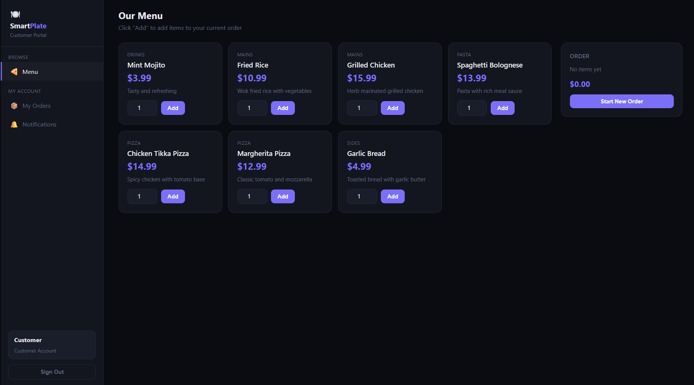

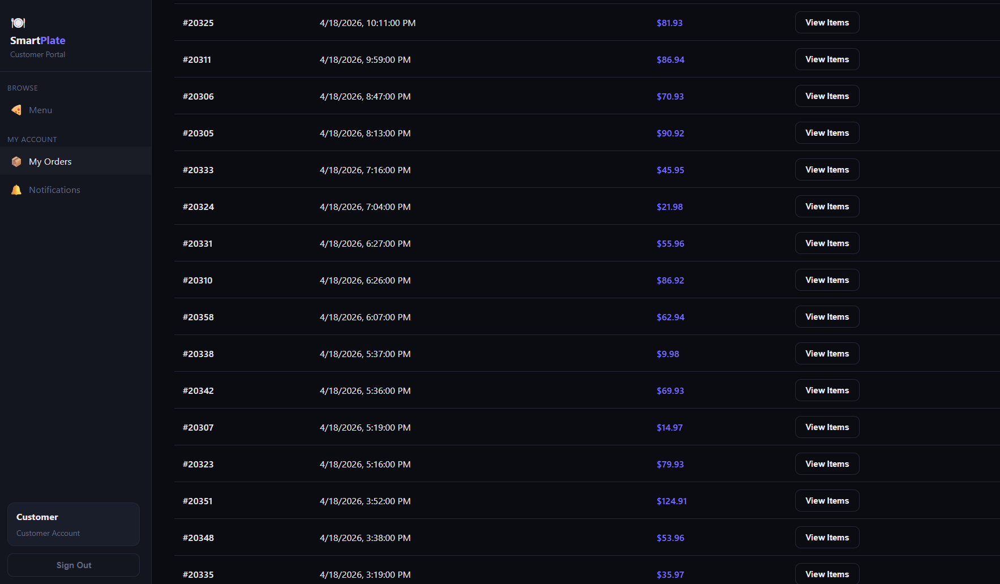

### 18.2 Chef

Active orders queue with controls to advance line-item status (`being prepared → out for delivery → delivered`).

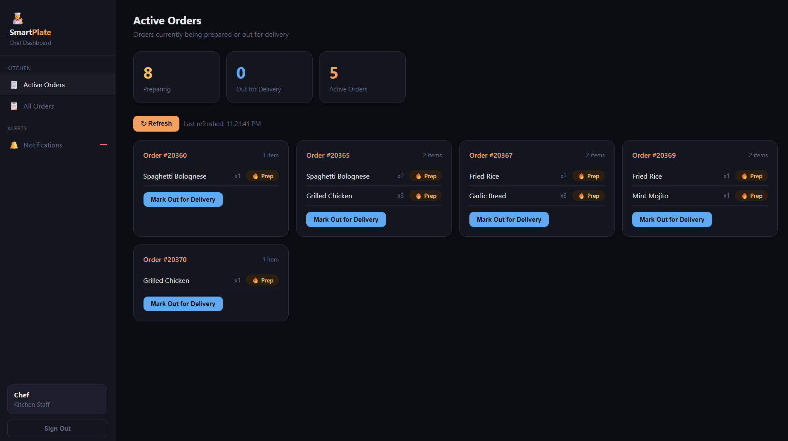

### 18.3 Employee

Ingredient view with supplier listings and the form to place a replenishment batch.

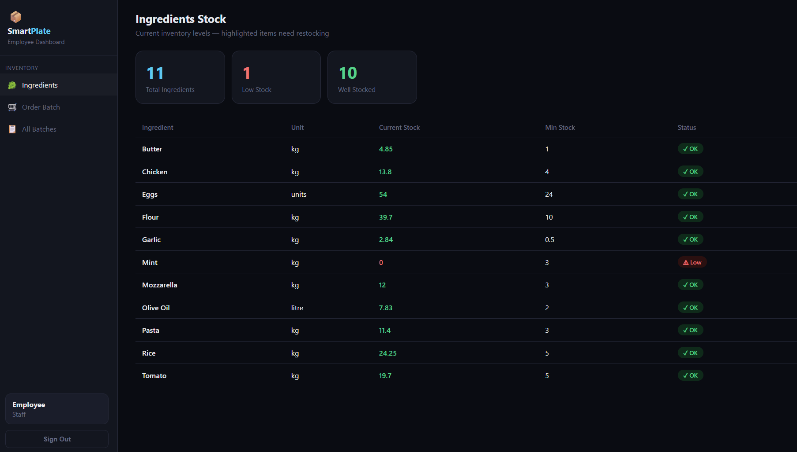

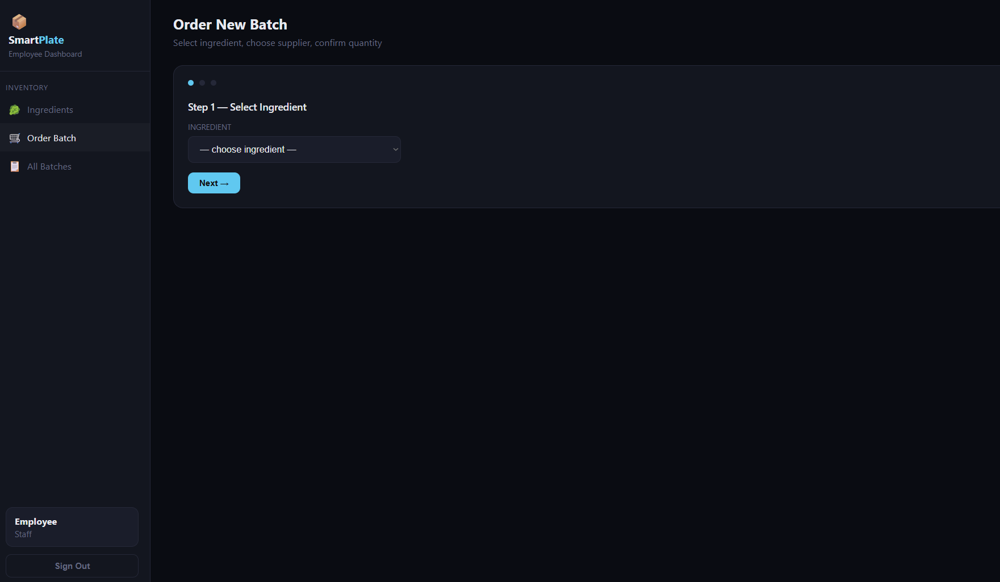

### 18.4 Supplier

Supplier dashboard for editing the `Supplies` catalogue (price/unit per ingredient) and progressing pending batch statuses.

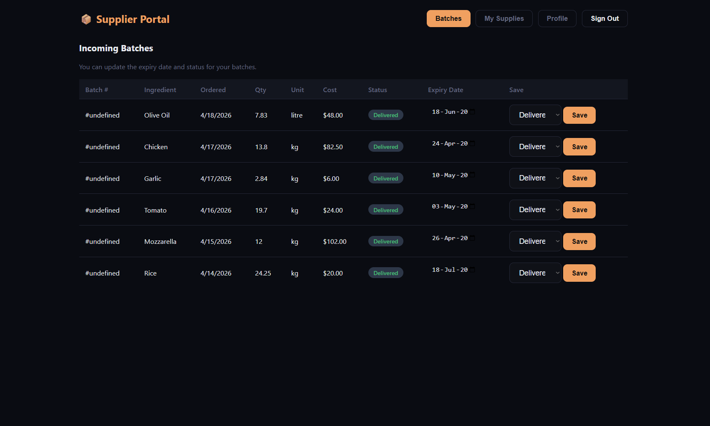

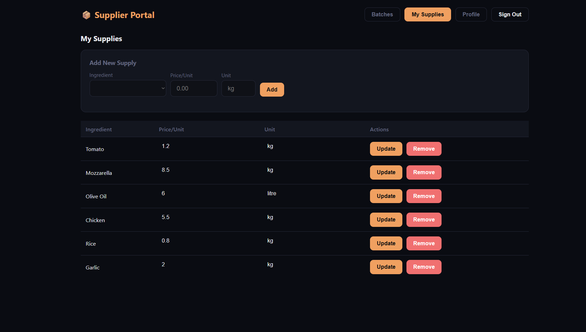

### 18.5 Manager

The manager dashboard exposes full CRUD across the schema. The landing view shows the operational summary; the tabs below cover users, ingredients, menu items, and gift codes.

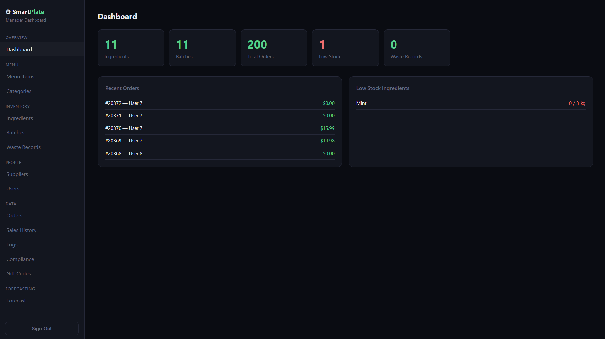

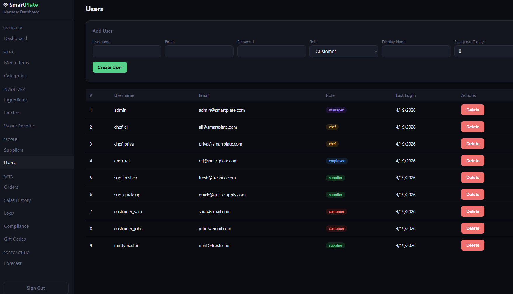

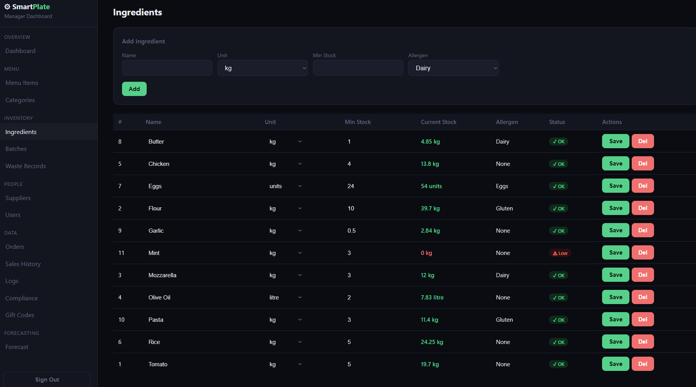

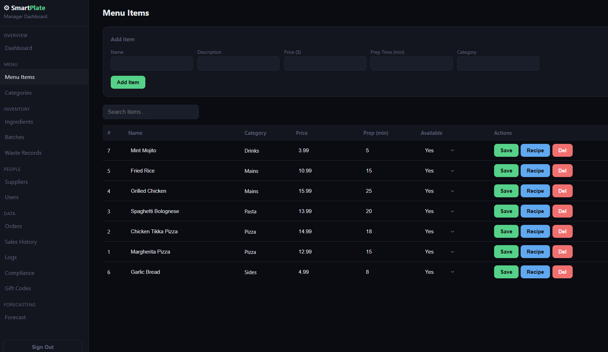

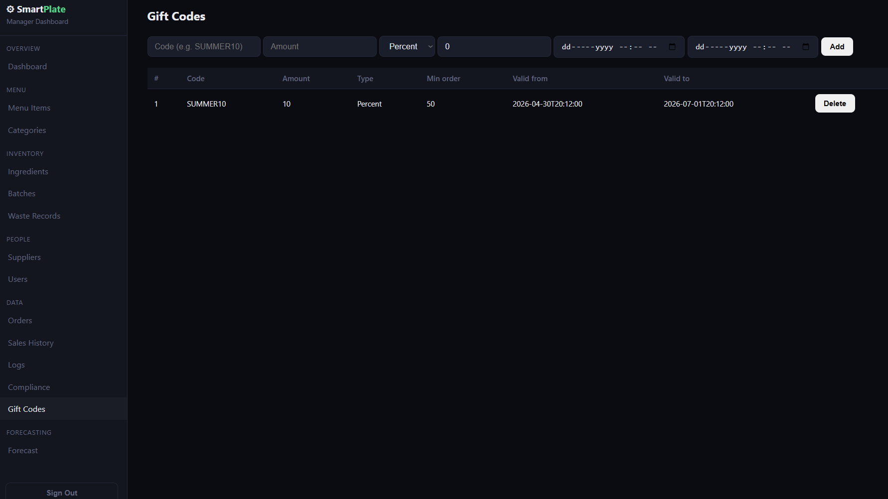

## 19. How to Run

See `README.md` for the canonical instructions. In summary:

1. Load SQL files in order into a running MySQL 8.x: `init_schema → procedures → triggers → events → ml_schema → ml_forecast → dummy_data`.
2. Enable the event scheduler.
3. `uvicorn main:app --reload` from `backend/`.
4. `python -m http.server 5500` from the project root.
5. Open `http://localhost:5500/index.html` and log in with any seeded user (password `password123`).

## 20. References

* MySQL 8.0 Reference Manual — [https://dev.mysql.com/doc/refman/8.0/en/](https://dev.mysql.com/doc/refman/8.0/en/)
  * Stored procedures and cursors — [https://dev.mysql.com/doc/refman/8.0/en/cursors.html](https://dev.mysql.com/doc/refman/8.0/en/cursors.html)
  * Triggers — [https://dev.mysql.com/doc/refman/8.0/en/triggers.html](https://dev.mysql.com/doc/refman/8.0/en/triggers.html)
  * Events — [https://dev.mysql.com/doc/refman/8.0/en/events.html](https://dev.mysql.com/doc/refman/8.0/en/events.html)
  * SIGNAL / RESIGNAL — [https://dev.mysql.com/doc/refman/8.0/en/signal.html](https://dev.mysql.com/doc/refman/8.0/en/signal.html)
* FastAPI — [https://fastapi.tiangolo.com/](https://fastapi.tiangolo.com/)
* Uvicorn — [https://www.uvicorn.org/](https://www.uvicorn.org/)
* PyMySQL — [https://pymysql.readthedocs.io/](https://pymysql.readthedocs.io/)
* Passlib (bcrypt) — [https://passlib.readthedocs.io/](https://passlib.readthedocs.io/)
* python-jose (JWT) — [https://python-jose.readthedocs.io/](https://python-jose.readthedocs.io/)
* python-dotenv — [https://pypi.org/project/python-dotenv/](https://pypi.org/project/python-dotenv/)
* Elmasri & Navathe, *Fundamentals of Database Systems* (textbook) — ER-model and normalisation foundations.
* Silberschatz, Korth, Sudarshan, *Database System Concepts* (textbook).
